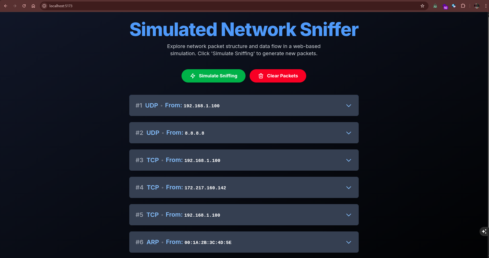
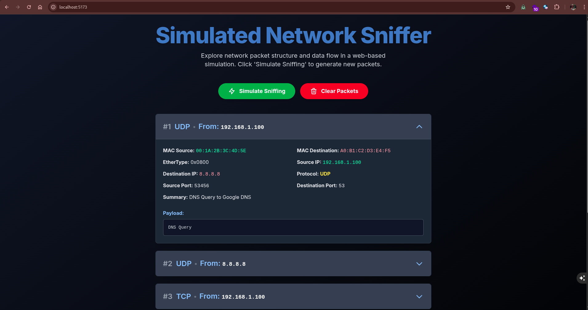

# 🛰️ Simulated Network Sniffer

A Web-Based Learning Tool to Understand Network Traffic — Visually, Safely & Intelligently

[]() 
[]() 
[]()

---

## 📌 About the Project

The Simulated Network Sniffer is a browser-based application built to help students, developers, and cybersecurity enthusiasts learn the fundamentals of packet capture and protocol analysis — without requiring root access or complex system setup.

Instead of capturing live traffic, this app uses Google’s Gemini AI to generate highly realistic, protocol-based packet data. The result? A powerful, safe, and interactive simulation of how actual sniffers work.

> 🧠 Learn the structure of real-world packets.
> 👨‍💻 Explore protocols like TCP, UDP, ICMP, ARP.
> 📊 Inspect detailed packet data — all in your browser.

---

## 🌟 Key Highlights

✅  Simulated Packet Generation (powered by Gemini AI)
✅  Realistic Data Structures for TCP, UDP, ICMP, and ARP
✅  Interactive Packet Inspector with expandable views
✅  Modern, Responsive UI built with Tailwind CSS
✅  No installation, runs fully in-browser

---

## 🖼️ Screenshot

> Add a screenshot or GIF demo here
> Example:
> 
> 

---

## 🔍 Features at a Glance

| Feature                 | Description                                                           |
| ----------------------- | --------------------------------------------------------------------- |
| 🎮 Click-to-Simulate    | Generate lifelike network traffic instantly using Gemini AI           |
| 📦 Protocol Support     | Visualize packets from TCP, UDP, ICMP, and ARP                        |
| 🧩 Expandable Cards     | Drill down into headers, ports, flags, sequence numbers, and payloads |
| 📱 Responsive Design    | Works seamlessly across desktop and mobile devices                    |
| 🧹 Clear with One Click | Remove all packets from the view with ease                            |

---

## 🛠️ Tech Stack

| Technology        | Purpose                         |
| ----------------- | ------------------------------- |
| React (via CDN)   | Component-based UI rendering    |
| Tailwind CSS      | Responsive & fast styling       |
| Google Gemini API | AI-based packet data simulation |
| HTML5             | Web structure                   |
| Babel             | JSX transpilation in-browser    |

---

## 🚀 Getting Started

### 📌 Prerequisites

* A modern web browser (Chrome, Firefox, Edge, Safari)
* Google Gemini API Key

🔐 To obtain a Gemini API Key:

1. Visit [https://aistudio.google.com/](https://aistudio.google.com/)
2. Log in using your Google account
3. Navigate to "API Keys" in the sidebar
4. Generate a new API key and copy it securely

---

### 📦 Installation

Clone the repository:

```bash
git clone https://github.com/KIRAN-KUMAR-K3/CodeAlpha_Basic_network_sniffer.git
cd CodeAlpha_Basic_network_sniffer
```

Insert your API key:

1. Open index.html in a code editor
2. Replace the placeholder:

```js
const apiKey = "YOUR_GEMINI_API_KEY_HERE";
```

3. Save the file

Run the app:

* Open index.html in your browser. That’s it!

---

## 🧪 How to Use

| Action               | What It Does                                               |
| -------------------- | ---------------------------------------------------------- |
| ▶️ Simulate Sniffing | Generates a batch of simulated packets from Gemini AI      |
| ❌ Clear Packets      | Removes all currently displayed packets                    |
| ⬇️ Expand Packet     | Reveals full details including headers, flags, and payload |

---

## 📂 Additional Mode: CLI-Based Sniffer

📁 Path: CLI-BASED
🔗 GitHub Link: [CLI Version](https://github.com/KIRAN-KUMAR-K3/CodeAlpha_Basic_network_sniffer/tree/main/CLI-BASED)

A real-world, command-line-based network sniffer implemented using Python and Scapy — designed to run with root privileges in a virtual environment.

### 🔧 CLI Setup Instructions

1. Create a virtual environment:

   ```bash
   python3 -m venv venu
   source venu/bin/activate
   ```

2. Install requirements:

   ```bash
   pip install -r requiremets.txt
   ```

3. Run the sniffer with root privileges:

   ```bash
   sudo python3 run.py
   ```

### 🖥️ Output Sample

```
--- New Packet Captured ---
  MAC Source: 54:47:e8:b7:73:85
  MAC Destination: 14:13:33:df:6a:0d
  EtherType: 2048
  Source IP: 157.90.91.74
  Destination IP: 192.168.1.7
  Protocol: TCP
  Source Port: 443
  Destination Port: 48036
  Flags: PA
  Sequence Number: 3379048104
  Acknowledgement Number: 410952807
  Payload: F-{8Mz1.;g5
----------------------------
```

📌 This version allows capturing live packets and printing decoded fields including MAC addresses, IP addresses, ports, flags, and payloads — making it ideal for command-line learners and ethical hackers.

---

## 👨‍🎓 Ideal For

* Computer Science Students
* Cybersecurity Beginners
* Educators & Trainers
* Self-Learners Exploring Networking

---

## 🤝 Contributing

Contributions are welcomed and appreciated! To contribute:

1. Fork the repository
2. Create your feature branch
3. Make your changes and commit them
4. Push your branch and create a Pull Request

Let’s grow this educational tool together!

---

## 📃 License

This project is licensed under the MIT License.
See the LICENSE file for full terms.

---

## 🙋 Contact & Credits

Built by: [Kiran Kumar K](https://github.com/KIRAN-KUMAR-K3)
📧 [18kirankumar.k03@gmail.com](mailto:18kirankumar.k03@gmail.com)

